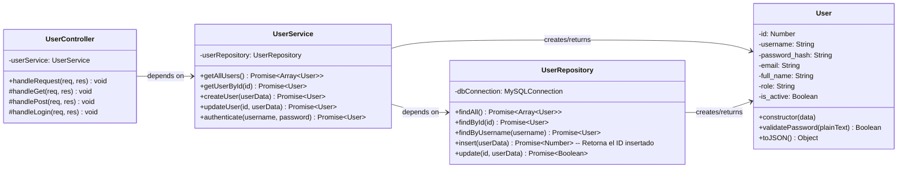
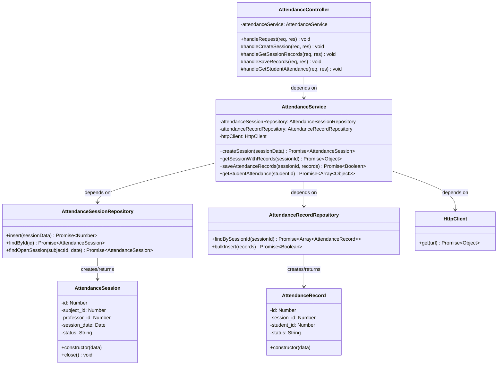

Perfecto. Procedamos con el **Diseño de Detalle Procedimental (Diagrama de Clases)**. Este diagrama es crucial porque define la estructura interna de cada microservicio, mostrando las entidades (clases) principales, sus responsabilidades y relaciones.

**Recordatorio clave de nuestro contexto:**
*   **Arquitectura:** Microservicios.
*   **Lenguaje:** JavaScript (Node.js nativo, sin frameworks).
*   **Comunicación:** HTTP/REST.
*   **Cada servicio es independiente.** Por lo tanto, **cada servicio tendrá su propio conjunto de clases** que representan sus entidades de dominio y lógica.

Vamos a diseñar las clases pensando en una estructura simple pero robusta, separando la lógica de negocio de la lógica de HTTP y la base de datos.

---

### Diagrama de Clases por Microservicio

### 1. User Service

Este servicio se encarga de la gestión de usuarios. Su dominio principal es la entidad `User`.



**Explicación:**
*   **`User`:** Clase de dominio que representa a un usuario. Contiene la lógica de negocio, como la validación de contraseñas (aunque el hash se haría en el servicio).
*   **`UserRepository`:** Se encarga de **toda la interacción con la base de datos** (`users_db`). Recibe y devuelve objetos `User`. Aísla el resto de la aplicación del código SQL.
*   **`UserService`:** Contiene la **lógica de negocio** del servicio (reglas de negocio, hashing de contraseñas con `bcrypt`). Utiliza el `UserRepository` para persistir datos.
*   **`UserController`:** Se encarga de manejar las **peticiones HTTP entrantes**. Parsea los datos de la request, los pasa al `UserService` y formata la respuesta HTTP. En un servicio sin framework, esta clase tendría un método `handleRequest` que analiza la URL y el método HTTP.

---

### 2. Catalog Service

Este servicio gestiona las materias (`Subject`) y las relaciones con profesores y estudiantes (`SubjectStudent`, `SubjectTeacher`).

```mermaid
classDiagram
    direction TB

    class SubjectController {
        -subjectService: SubjectService
        +handleRequest(req, res) void
        #handleGetSubjects(req, res) void
        #handlePostSubject(req, res) void
        #handleGetSubjectStudents(req, res) void
        #handlePostSubjectStudent(req, res) void
    }

    class SubjectService {
        -subjectRepository: SubjectRepository
        -enrollmentRepository: EnrollmentRepository
        +getAllSubjects() Promise~Array~Subject~~
        +createSubject(subjectData) Promise~Subject~
        +getStudentsBySubjectId(subjectId) Promise~Array~Object~~
        +addStudentToSubject(subjectId, studentId) Promise~Boolean~
    }

    class SubjectRepository {
        +findAll() Promise~Array~Subject~~
        +findById(id) Promise~Subject~
        +insert(subjectData) Promise~Number~
    }

    class EnrollmentRepository {
        +findStudentsBySubjectId(subjectId) Promise~Array~Object~~ -- Objeto con {student_id, full_name}
        +addStudentToSubject(subjectId, studentId) Promise~Boolean~
        +isStudentEnrolled(subjectId, studentId) Promise~Boolean~
    }

    class Subject {
        -id: Number
        -code: String
        -name: String
        -description: String
        +constructor(data)
    }

    SubjectController --> SubjectService : depends on
    SubjectService --> SubjectRepository : depends on
    SubjectService --> EnrollmentRepository : depends on
    SubjectRepository --> Subject : creates/returns
```

**Explicación:**
*   **`Subject`:** Entidad de dominio para una materia.
*   **`EnrollmentRepository`:** Repositorio especializado para manejar las operaciones de inscripción (tablas `subject_students` y `subject_teachers`). Nota cómo se separa la responsabilidad del `SubjectRepository`.
*   **`SubjectService`:** Orquesta las operaciones. Por ejemplo, para `getStudentsBySubjectId`, primero usaría `SubjectRepository` para verificar que la materia existe, y luego `EnrollmentRepository` para obtener la lista de estudiantes.
*   **`SubjectController`:** Maneja los endpoints como `/subjects` y `/subjects/:id/students`.

---

### 3. Attendance Service

Este es el servicio más complejo. Gestiona las sesiones de asistencia (`AttendanceSession`) y los registros individuales (`AttendanceRecord`). **Crucialmente, depende de los otros servicios.**



**Explicación:**
*   **`AttendanceSession` y `AttendanceRecord`:** Entidades de dominio que representan una sesión de clase y la asistencia de un estudiante en esa sesión, respectivamente.
*   **`HttpClient`:** Esta es una clase clave. Es una utilidad que encapsula las llamadas HTTP a otros servicios (por ejemplo, usando el módulo nativo `https` de Node.js). El `AttendanceService` la usaría para:
    *   Validar con el **Catalog Service** que el `professor_id` está asignado al `subject_id` antes de crear una sesión.
    *   Obtener del **Catalog Service** la lista de `student_id` inscritos en una materia para generar los `AttendanceRecord` iniciales.
    *   Obtener del **User Service** los nombres de los estudiantes para enriquecer la respuesta cuando se pide la lista de una sesión.
*   **`AttendanceService`:** Aquí reside la lógica compleja. Por ejemplo, el método `createSession` haría:
    1.  (Usando `HttpClient`) Llamar a `GET /subjects/:subjectId` en el Catalog Service para validar que la materia existe.
    2.  Llamar a una API (a definir) para validar que el profesor está asignado a la materia.
    3.  Verificar que no existe una sesión abierta para la misma materia y fecha.
    4.  Si todo es correcto, crear la sesión en la base de datos.
*   **`AttendanceController`:** Maneja los endpoints específicos de la asistencia.

---
